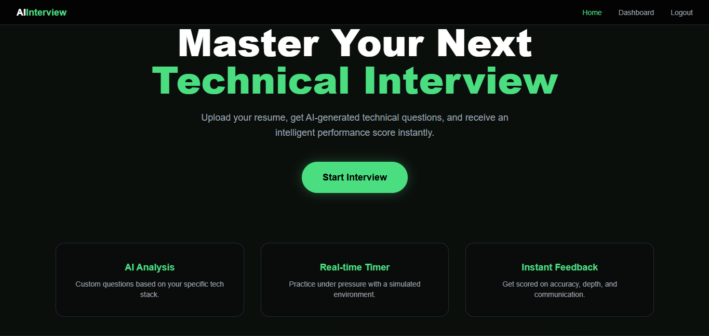
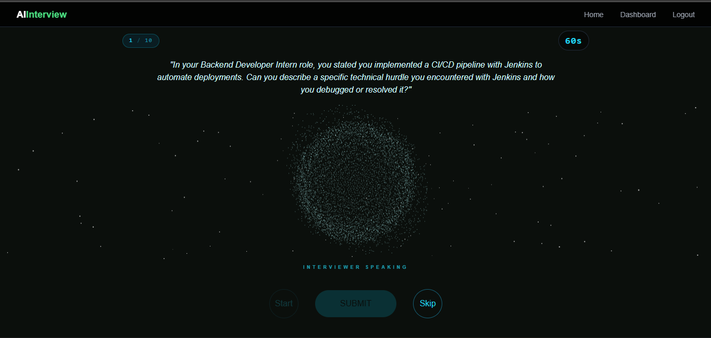
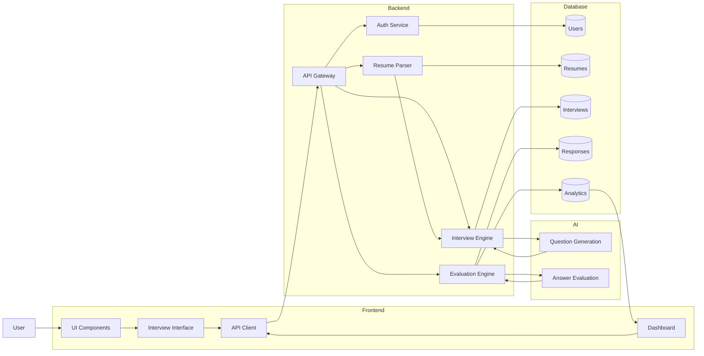

<<<<<<< HEAD
# React + Vite

This template provides a minimal setup to get React working in Vite with HMR and some ESLint rules.

Currently, two official plugins are available:

- [@vitejs/plugin-react](https://github.com/vitejs/vite-plugin-react/blob/main/packages/plugin-react) uses [Babel](https://babeljs.io/) (or [oxc](https://oxc.rs) when used in [rolldown-vite](https://vite.dev/guide/rolldown)) for Fast Refresh
- [@vitejs/plugin-react-swc](https://github.com/vitejs/vite-plugin-react/blob/main/packages/plugin-react-swc) uses [SWC](https://swc.rs/) for Fast Refresh

## React Compiler

The React Compiler is not enabled on this template because of its impact on dev & build performances. To add it, see [this documentation](https://react.dev/learn/react-compiler/installation).

## Expanding the ESLint configuration

If you are developing a production application, we recommend using TypeScript with type-aware lint rules enabled. Check out the [TS template](https://github.com/vitejs/vite/tree/main/packages/create-vite/template-react-ts) for information on how to integrate TypeScript and [`typescript-eslint`](https://typescript-eslint.io) in your project.
=======
# Resume-Based AI Interview System

An AI-powered interview platform that generates personalized interview questions from a candidate’s resume and evaluates responses with intelligent feedback.

---

## 📸 Project Preview

  

  

---

## Overview

This system automates the interview process by analyzing resumes and conducting AI-driven interviews. It helps candidates practice and enables scalable evaluation without manual intervention.

---

## Features

- Resume parsing to extract skills, experience, and projects  
- AI-based question generation tailored to the candidate profile  
- Answer evaluation based on relevance, accuracy, and clarity  
- Detailed feedback with improvement suggestions  
- Performance analytics dashboard

---
## 🏗️ System Architecture

---
## Workflow

1. Upload resume  
2. Extract key information (skills, projects, experience)  
3. Generate interview questions using AI  
4. Candidate submits answers  
5. AI evaluates responses  
6. Display scores and feedback  

---
## Tech Stack

**Frontend**
- React.js  
- Three.js  
- Tailwind CSS  

**Backend**
- Node.js  
- Express.js  

**AI Integration**
- Google Gemini API  

**Database**
- MongoDB  

---

## Output Metrics

- Question-wise score  
- Overall interview score  
- Skill-based performance analysis  
- AI-generated feedback and suggestions  

---

## Use Cases

- Student placement preparation  
- Mock interview practice  
- Recruitment pre-screening  
- Skill assessment  

---

## Future Improvements

- Voice-based interview support  
- Multi-language capability  
- Advanced analytics dashboard  
- Real-time interaction enhancements  

---
>>>>>>> Ai_Interview_Assistant/master
